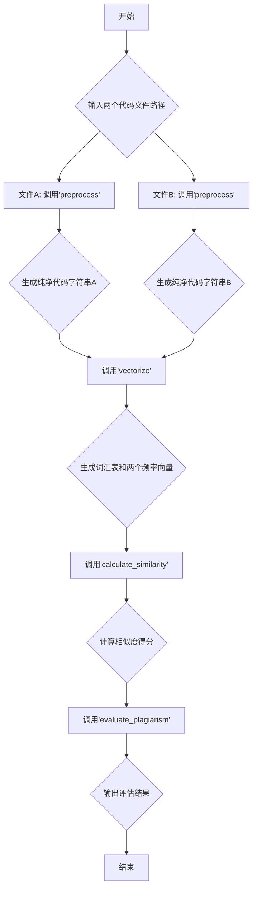

# 项目：C语言代码相似度检测系统

根据您的课程设计任务书，我将此项目分解为以下几个部分，包括任务概述、功能模块、所需技能以及一份详细的三周开发计划，以帮助您更好地实践。

## 1. 任务概述

本项目旨在设计并实现一个基于C语言的程序代码相似度检测系统。系统将接收两个C语言源代码文件作为输入，通过一系列处理与计算，最终输出一个介于0和1之间的相似度得分，并根据预设阈值判断是否存在抄袭风险。核心算法将采用**余弦相似度**，该方法能有效忽略代码格式、注释和变量名等非本质差异，提高检测的准确性。

## 2. 核心功能模块分解

为了实现模块化和易于管理的代码，建议将系统划分为以下四个核心函数（模块）：

#### 模块一：代码预处理 (`preprocess`)
- **功能**：清理输入的源代码文件，移除对相似度计算无影响或有干扰的元素。
- **输入**：文件路径（`const char* filepath`）。
- **输出**：一个包含纯净代码（无注释、多余空白、头文件等）的字符串（`char*`）。
- **处理步骤**：
    1. 读取整个源文件内容到内存中。
    2. 移除单行注释 (`// ...`) 和多行注释 (`/* ... */`)。
    3. 移除 `#include`、`#define` 等预处理指令。
    4. 将所有代码文本转换为小写，以避免大小写导致的差异。
    5. 将所有空白字符（如换行符 `
`、制表符 `	`、多个空格）统一替换为单个空格。
    6. 移除所有字符串字面量（例如 "Hello, World!"），因为它们通常与逻辑无关。

#### 模块二：代码转换（向量化） (`vectorize`)
- **功能**：将预处理后的代码字符串转换为数学向量，这是余弦相似度计算的基础。此过程通常采用“词袋模型”（Bag-of-Words）。
- **核心数据结构**：
    - **词汇表 (Vocabulary)**：一个包含两个文件中所有唯一“单词”（即C语言的关键字、标识符、运算符）的集合。可以使用哈希表或动态数组实现。
    - **频率向量 (Frequency Vector)**：一个整数数组，其长度等于词汇表的大小。数组的每个元素代表词汇表中对应单词在当前代码文件中出现的次数。
- **处理步骤**：
    1. **分词 (Tokenization)**：将预处理后的代码字符串按空格分割成一个个独立的“单词”或“标记"(Token)。
    2. **构建词汇表**：遍历两个代码文件的所有Tokens，将所有不重复的Tokens收集起来，形成一个完整的词汇表。
    3. **生成频率向量**：对每个代码文件，创建一个与词汇表等长的向量。遍历词汇表，统计每个单词在该文件中出现的频率，并填入向量的对应位置。

#### 模块三：相似度计算 (`calculate_similarity`)
- **功能**：根据余弦相似度公式，计算两个频率向量之间的相似度得分。
- **输入**：两个频率向量（`int* vectorA`, `int* vectorB`）及其长度。
- **输出**：一个 `double` 类型的相似度得分。
- **计算公式**：
  `Similarity = (A · B) / (||A|| * ||B||)`
- **处理步骤**：
    1. **计算点积 (Dot Product)**：将两个向量对应位置的元素相乘，然后求和。
    2. **计算向量的模 (Magnitude/Norm)**：对每个向量，将其所有元素的平方相加，然后取平方根。
    3. **计算最终得分**：将点积除以两个向量模的乘积。

#### 模块四：抄袭评估 (`evaluate_plagiarism`)
- **功能**：根据计算出的相似度得分和预设的阈值，给出评估结果。
- **输入**：相似度得分（`double similarity_score`）。
- **输出**：打印评估结果到控制台。
- **处理步骤**：
    1. 设定几个评估阈值，例如：
        - `HIGHLY_SIMILAR_THRESHOLD = 0.9`
        - `POSSIBLY_SIMILAR_THRESHOLD = 0.7`
    2. 根据得分判断并输出结果：
        - 如果得分 >= 0.9，则输出“高度相似，可能存在抄袭”。
        - 如果得分 >= 0.7，则输出“比较相似，建议人工审查”。
        - 否则，输出“相似度较低”。

## 2.5 系统流程图



## 3. 所需技能与知识储备

为了顺利完成此项目，您需要掌握以下技能：

- **C语言基础与进阶**：
    - **文件操作**：`fopen`, `fread`, `fclose` 等，用于读写源代码文件。
    - **字符串处理**：熟练使用 `<string.h>` 中的函数，如 `strcpy`, `strcat`, `strstr`, `strtok_r` 等。
    - **动态内存管理**：`malloc`, `calloc`, `realloc`, `free`，用于处理大小不定的字符串和数据结构。
    - **函数与模块化编程**：将代码合理地组织到不同的函数和 `.c`/`.h` 文件中。
    - **数据结构实现**：能够手动实现简单的数据结构，如动态数组或哈希表（用于构建词汇表）。

- **算法与数据结构**：
    - **哈希表（Hash Table）**：强烈推荐使用哈希表来高效地构建词汇表和统计词频，其平均时间复杂度为 O(1)。
    - **动态数组（Dynamic Array）**：如果不想实现哈希表，动态数组是次优选择，但查找效率较低（O(n)）。

- **数学知识**：
    - **向量（Vector）**：理解向量的基本概念。
    - **余弦相似度（Cosine Similarity）**：理解其几何意义（向量夹角的余弦）和代数计算公式。

## 4. 三周开发计划（任务书）

本计划将整个开发过程分解到三周内完成。

---

### **第一周：基础构建与代码预处理**

- **目标**：完成项目框架的搭建和核心的预处理模块。
- **任务**：
    1. **（第1-2天）环境搭建与项目规划**：
        - 配置好C语言开发环境（如 `GCC` + `VS Code` 或其他IDE）。
        - 创建项目文件夹结构，例如包含 `src`, `include`, `tests`, `output` 等子目录。
        - 再次熟悉余弦相似度算法和整个流程，确定数据结构的选择（推荐哈希表）。
    2. **（第3-6天）实现预处理模块 (`preprocess`)**：
        - 编写一个函数，接收文件路径，读取文件内容。
        - **重点**：实现移除注释的逻辑。可以逐字符扫描，通过状态标记（如 `in_multiline_comment`）来判断当前是否在注释内。
        - 实现移除空白字符和特定预处理指令的逻辑。
        - 编写主函数 `main.c` 用于测试该模块。准备几个包含不同注释风格和格式的C文件作为测试用例。
    3. **（第7天）周总结与代码优化**：
        - 确保预处理模块能正确处理各种边界情况（如注释嵌套、文件末尾的注释等）。
        - 检查代码是否存在内存泄漏。
        - 整理代码，添加必要的注释。

---

### **第二周：向量化与相似度计算**

- **目标**：将预处理后的代码转换为向量，并完成相似度计算。
- **任务**：
    1. **（第8-10天）实现数据结构与向量化 (`vectorize`)**：
        - 设计并实现用于词汇表的哈希表（或动态数组）。哈希表应支持插入、查找功能。
        - 实现分词（Tokenization）功能，将干净的代码字符串分解为单词。
        - 编写函数以构建词汇表（合并两个文件的所有唯一单词）。
        - 编写函数以生成每个文件的词频向量。
    2. **（第11-13天）实现相似度计算模块 (`calculate_similarity`)**：
        - 编写一个独立的函数来计算两个向量的点积。
        - 编写另一个函数来计算单个向量的模。
        - 实现 `calculate_similarity` 函数，整合上述计算并返回最终得分。
    3. **（第14天）集成测试**：
        - 在 `main` 函数中，将第一周和第二周的模块串联起来。
        - 完整地执行“读取文件 -> 预处理 -> 向量化 -> 计算相似度”的流程。
        - 用简单的测试用例验证结果（如两个完全相同的文件相似度是否为1.0，两个完全不同的文件相似度是否接近0）。

---

### **第三周：系统完善与文档撰写**

- **目标**：完成最终的评估功能，并撰写完整的项目文档。
- **任务**：
    1. **（第15-16天）实现评估模块与完善用户交互**：
        - 实现 `evaluate_plagiarism` 函数，根据得分输出评估结果。
        - 在 `main` 函数中添加简单的命令行交互，让用户可以输入两个文件名来执行检测。
        - 对输出结果进行格式化，使其清晰易读。
    2. **（第17-18天）最终测试与调试**：
        - 准备更多样化的测试用例（例如，仅修改变量名、调换函数顺序、增加无关代码等）。
        - 测试系统的鲁棒性，特别是对于空文件、不存在的文件等异常情况的处理。
        - 修复所有发现的BUG和内存泄漏。
    3. **（第19-21天）撰写设计说明书与整理材料**：
        - 按照任务书要求，开始撰写设计说明书。
        - **总体设计**：描述四大功能模块及其关系。
        - **数据结构设计**：详细说明你所用的哈希表（或数组）是如何设计和工作的。
        - **模块功能介绍**：为每个函数编写清晰的功能、参数和返回值说明。
        - **调试分析**：整理你的测试用例、测试过程和结果截图。
        - **总结**：回顾整个项目，总结收获与待改进之处。
        - 将所有源代码、设计文档和测试数据整理归档，准备提交。

祝您课程设计顺利！

## 5. 代码实现步骤概览

为了让代码结构清晰、易于维护，建议遵循以下高级步骤：

#### 1. 文件结构
建议将不同的功能模块拆分到不同的文件中，例如：
- `main.c`: 程序主入口，负责流程控制和用户交互。
- `preprocess.h` / `preprocess.c`: 声明和实现代码预处理功能。
- `vectorizer.h` / `vectorizer.c`: 声明和实现数据结构（如哈希表）及代码向量化功能。
- `similarity.h` / `similarity.c`: 声明和实现余弦相似度计算功能。

#### 2. 主函数 `main.c` 逻辑
`main` 函数是整个程序的“指挥官”，其主要任务是：
1.  **接收输入**：通过命令行参数 `(int argc, char *argv[])` 获取用户传入的两个文件名。
2.  **调用模块**：
    - 调用 `preprocess()` 处理两个文件，得到两个纯净的代码字符串。
    - 调用 `vectorize()` 将两个字符串转换成词频向量。
    - 调用 `calculate_similarity()` 计算得分。
    - 调用 `evaluate_plagiarism()` 打印最终评估结果。
3.  **管理内存**：在所有操作完成后，务必调用 `free()` 释放所有动态分配的内存（如预处理后的字符串、词汇表、频率向量等），避免内存泄漏。

#### 3. 核心数据结构
- 在 `vectorizer.h` 中定义你的核心数据结构。例如，一个用于哈希表的 `struct Node` 和 `struct HashTable`。
- 将词汇表和词频向量作为结构体封装起来，方便在函数间传递。

#### 4. 编译代码
当你拥有多个 `.c` 文件时，你需要将它们一起编译。使用 `gcc` 的示例如下：
```bash
# -o main 指定输出的可执行文件名为 main
# -Iinclude 指定头文件的搜索路径
# src/*.c 将 src 文件夹下所有的 .c 文件都进行编译
# -lm 链接数学库，因为计算向量模时需要用到 sqrt 函数
gcc -o main src/main.c src/preprocess.c src/vectorizer.c src/similarity.c -Iinclude -lm
```
这个命令会将所有 `.c` 文件编译并链接成一个名为 `main` (或 `main.exe`) 的可执行文件。
